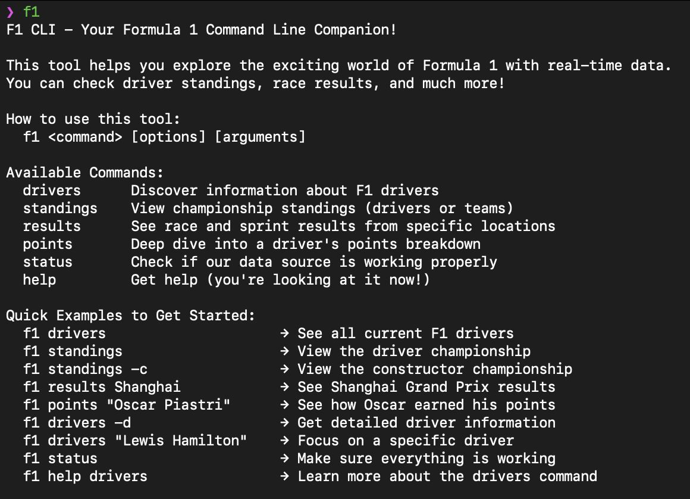
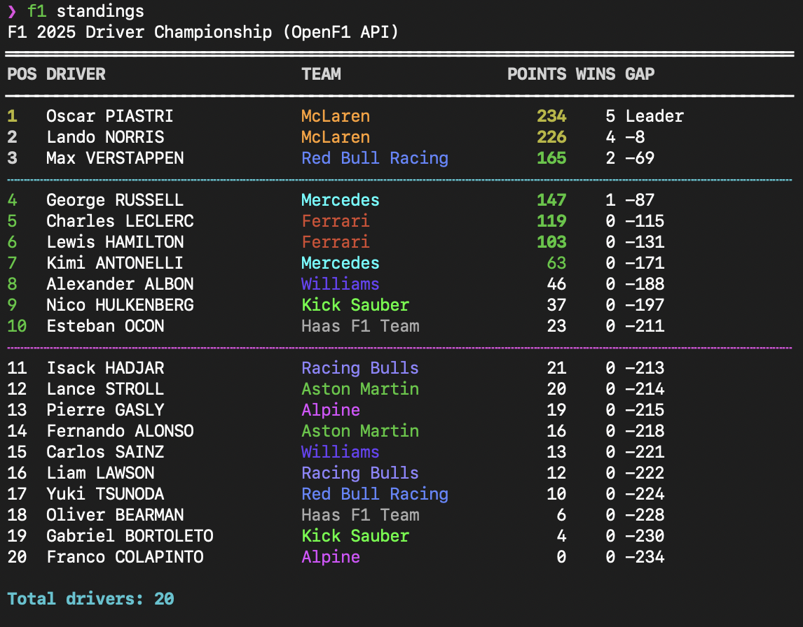

# F1 CLI

A command-line tool for checking Formula 1 championship standings and race results in real-time.



## Installation

```bash
git clone https://github.com/karanm6505/f1-cli.git
cd cli
go build -o f1
sudo cp f1 /usr/local/bin/
```

Now you can use `f1` from anywhere on your system.

## Commands

### Championship Standings
```bash
f1 standings           # Driver championship
f1 standings -c        # Constructor championship
```

### Race Results
```bash
f1 results Monaco      # Monaco GP results
f1 results Shanghai    # Shanghai GP results
f1 results             # List all available races
```



### Driver Details
```bash
f1 points "Oscar Piastri"    # Points breakdown by race
f1 points "Max Verstappen"   # See race-by-race points
```

### Other Commands
```bash
f1 drivers             # List all current drivers
f1 status              # Check API connection
f1 help                # Show all commands
```

## Features

- **Live data** from the OpenF1 API
- **Accurate standings** calculated from individual race results
- **Color-coded** teams and positions
- **Handles complex scenarios** like disqualifications and position adjustments
- **Both races and sprints** with proper points systems

## How it works

Gets raw race results from OpenF1 API, then calculates championship standings using F1's official points system (25-18-15... for races, 8-7-6... for sprints). Handles disqualifications and position changes automatically.

## Requirements

- Internet connection for API access
- Terminal with color support
